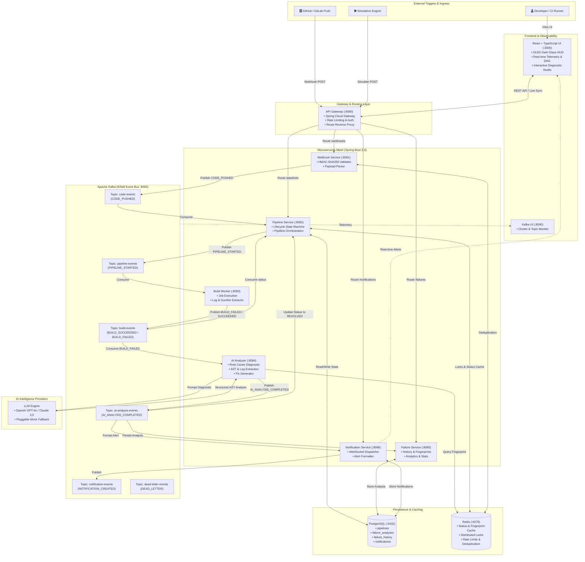
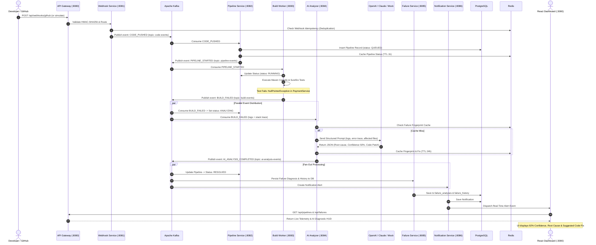
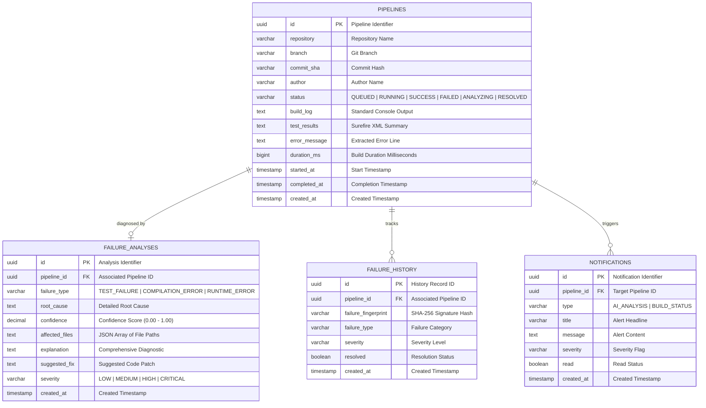

# CICD-AI: AI-Powered CI/CD Failure Intelligence Platform

An event-driven microservices platform that automatically detects, analyzes, and explains CI/CD pipeline failures using AI.


## Table of Contents

- [Architecture](#architecture)
- [Quick Start](#quick-start)
- [Demo Walkthrough](#demo-walkthrough)
- [Services](#services)
- [Kafka Topics](#kafka-topics)
- [Database Schema](#database-schema)
- [Redis Usage](#redis-usage)
- [API Documentation](#api-documentation)
- [Configuration](#configuration)
- [Testing](#testing)
- [Design Decisions](#design-decisions)

---

## System Design & Architecture

### 1. High-Level Event-Driven Architecture



---

### 2. End-to-End Failure Intelligence Sequence



---

### 3. Database Entity Relationship Model




### Services

| Service | Port | Description |
|---------|------|-------------|
| API Gateway | 8080 | Route requests, rate limiting, auth |
| Webhook Service | 8081 | GitHub webhook receiver, event publishing |
| Pipeline Service | 8082 | Pipeline lifecycle management |
| Build Worker | 8083 | Execute builds, capture results |
| AI Analyzer | 8084 | AI-powered failure root cause analysis |
| Failure Service | 8085 | Failure history and persistence |
| Notification Service | 8086 | Real-time notifications via WebSocket |
| Frontend | 3000 | React dashboard |
| Kafka UI | 8090 | Kafka monitoring dashboard |

### Infrastructure

| Component | Port | Purpose |
|-----------|------|---------|
| PostgreSQL | 5432 | Persistent storage |
| Redis | 6379 | Cache, locks, rate limiting |
| Apache Kafka | 9092 | Event bus (KRaft mode) |

---

## Quick Start

### Prerequisites

- Docker & Docker Compose
- 8GB+ RAM recommended

### 1. Clone & Configure

```bash
cp .env.example .env
# Edit .env if you want to set LLM_API_KEY for real AI analysis
# Leave empty for mock analyzer (works without any API key)
```

### 2. Start Everything

```bash
docker compose up --build
```

This starts all 7 microservices, PostgreSQL, Redis, Kafka, and the React frontend.

### 3. Access

| URL | Description |
|-----|-------------|
| http://localhost:3000 | React Dashboard |
| http://localhost:8090 | Kafka UI |
| http://localhost:8080 | API Gateway |

### 4. Stop

```bash
docker compose down
# To also remove data:
docker compose down -v
```

---

## Demo Walkthrough

### Simulate a Failing Build

1. Open the dashboard at **http://localhost:3000**
2. Click **"💥 Simulate Bug"** in the sidebar
3. Watch the pipeline flow in real-time:

```
Step 1: Webhook receives simulated push event
Step 2: CODE_PUSHED event → Kafka → Pipeline Service creates pipeline (QUEUED → RUNNING)
Step 3: Build Worker picks up PIPELINE_STARTED, runs simulated build
Step 4: Build fails (NullPointerException in PaymentService)
Step 5: BUILD_FAILED event → Kafka → AI Analyzer
Step 6: AI analyzes the failure, generates root cause + fix
Step 7: AI_ANALYSIS_COMPLETED → Kafka → Failure Service stores result
Step 8: Notification Service creates notification, pushes via WebSocket
Step 9: Dashboard updates: pipeline → RESOLVED, AI analysis visible
```

### Simulate a Successful Build

Click **"✅ Clean Push"** — pipeline flows through and completes successfully.

### API-based Simulation

```bash
# Trigger a failing build
curl -X POST http://localhost:8080/api/webhooks/simulate \
  -H "Content-Type: application/json" \
  -d '{"repository":"demo-repo","branch":"main","author":"developer","injectBug":true}'

# Trigger a passing build
curl -X POST http://localhost:8080/api/webhooks/simulate \
  -H "Content-Type: application/json" \
  -d '{"repository":"demo-repo","branch":"main","author":"developer","injectBug":false}'

# View pipelines
curl http://localhost:8080/api/pipelines | jq

# View pipeline stats
curl http://localhost:8080/api/pipelines/stats | jq

# View failure analyses
curl http://localhost:8080/api/failures | jq

# View notifications
curl http://localhost:8080/api/notifications | jq
```

---

## Kafka Topics

| Topic | Events | Producers | Consumers |
|-------|--------|-----------|-----------|
| `code-events` | CODE_PUSHED | Webhook Service | Pipeline Service |
| `pipeline-events` | PIPELINE_STARTED | Pipeline Service | Build Worker |
| `build-events` | BUILD_SUCCEEDED, BUILD_FAILED | Build Worker | Pipeline Service, AI Analyzer |
| `ai-analysis-events` | AI_ANALYSIS_COMPLETED | AI Analyzer | Pipeline Service, Failure Service, Notification Service |
| `notification-events` | NOTIFICATION_CREATED | Notification Service | — |
| `dead-letter-events` | Failed events | All services | Monitoring |

### Event Envelope

Every event follows this structure:

```json
{
  "eventId": "uuid",
  "eventType": "BUILD_FAILED",
  "eventVersion": "1.0",
  "timestamp": "2026-08-13T12:00:00Z",
  "source": "build-worker",
  "pipelineId": "uuid",
  "correlationId": "uuid",
  "payload": { ... }
}
```

### Event Flow

```
code-events         → Pipeline Service creates pipeline, publishes PIPELINE_STARTED
pipeline-events     → Build Worker runs build, publishes BUILD_SUCCEEDED/BUILD_FAILED
build-events        → Pipeline Service updates status; AI Analyzer analyzes failures
ai-analysis-events  → Pipeline Service → RESOLVED; Failure Service stores; Notification Service notifies
```

---

## Database Schema

### pipelines

| Column | Type | Description |
|--------|------|-------------|
| id | UUID (PK) | Pipeline identifier |
| repository | VARCHAR | Repository name |
| branch | VARCHAR | Branch name |
| commit_sha | VARCHAR(64) | Git commit SHA |
| author | VARCHAR | Commit author |
| status | VARCHAR(50) | QUEUED/RUNNING/SUCCESS/FAILED/ANALYZING/RESOLVED |
| build_log | TEXT | Full build output |
| test_results | TEXT | Test summary |
| error_message | TEXT | Error details |
| duration_ms | BIGINT | Build duration |
| created_at | TIMESTAMP | Record creation |

### failure_analyses

| Column | Type | Description |
|--------|------|-------------|
| id | UUID (PK) | Analysis identifier |
| pipeline_id | UUID | Associated pipeline |
| failure_type | VARCHAR | TEST_FAILURE, COMPILATION_ERROR, etc. |
| root_cause | TEXT | AI-determined root cause |
| confidence | DECIMAL(3,2) | AI confidence (0.00-1.00) |
| affected_files | TEXT | JSON array of file paths |
| explanation | TEXT | Detailed explanation |
| suggested_fix | TEXT | Code fix suggestion |
| severity | VARCHAR | LOW/MEDIUM/HIGH/CRITICAL |

### failure_history

| Column | Type | Description |
|--------|------|-------------|
| id | UUID (PK) | History identifier |
| pipeline_id | UUID | Associated pipeline |
| failure_fingerprint | VARCHAR(64) | SHA-256 hash for similarity |
| failure_type | VARCHAR | Failure category |
| severity | VARCHAR | Severity level |
| resolved | BOOLEAN | Resolution status |

---

## Redis Usage

| Key Pattern | Purpose | TTL |
|-------------|---------|-----|
| `pipeline:status:{id}` | Pipeline status cache | 1 hour |
| `failure:fingerprint:{hash}` | Similar failure cache | 24 hours |
| `rate-limit:{ip}` | API rate limiting (100/min) | 1 minute |
| `lock:pipeline:create:{repo}:{sha}` | Distributed lock for pipeline creation | 30 seconds |
| `lock:build:{pipelineId}` | Distributed lock for build execution | 5 minutes |
| `build:state:{pipelineId}` | Job state tracking | 10 minutes |
| `webhook:dedup:{repo}:{sha}` | Webhook deduplication | 10 minutes |
| `recent-failures` | Sorted set of recent failures | None (capped at 100) |
| `failure:count:{type}` | Failure type frequency | 24 hours |

---

## API Documentation

### Webhooks (via Gateway :8080)

```
POST /api/webhooks/github        GitHub webhook receiver (validates HMAC-SHA256)
POST /api/webhooks/simulate      Simulate a push event for demo
```

### Pipelines

```
GET  /api/pipelines              List all pipelines
GET  /api/pipelines/{id}         Get pipeline by ID
GET  /api/pipelines/stats        Get aggregate statistics
```

### Failures

```
GET  /api/failures               List failures (filter: ?repository=, ?severity=, ?failureType=)
GET  /api/failures/{id}          Get failure analysis by ID
GET  /api/failures/pipeline/{id} Get analysis for a specific pipeline
GET  /api/failures/similar/{fp}  Find similar failures by fingerprint
GET  /api/failures/history       Get failure history
```

### Notifications

```
GET  /api/notifications          List all notifications
GET  /api/notifications/unread   List unread notifications
GET  /api/notifications/count    Get unread count
PUT  /api/notifications/{id}/read  Mark notification as read
PUT  /api/notifications/read-all   Mark all as read
```

### Health Checks

Each service exposes: `GET /actuator/health`

---

## Configuration

All configuration is through environment variables. See `.env.example` for the full list.

### AI Configuration

| Variable | Default | Description |
|----------|---------|-------------|
| `LLM_API_KEY` | _(empty)_ | OpenAI API key. If empty, mock analyzer is used |
| `LLM_API_URL` | `https://api.openai.com/v1/chat/completions` | LLM API endpoint |
| `LLM_MODEL` | `gpt-4o-mini` | Model name |

The mock analyzer generates realistic analysis results that demonstrate the full flow without requiring any API key.

---

## Testing

### Run Demo Test

```bash
# Start services
docker compose up -d

# Wait for services (30-60 seconds for first build)

# Simulate a failing build
curl -X POST http://localhost:8080/api/webhooks/simulate \
  -H "Content-Type: application/json" \
  -d '{"repository":"demo-repo","branch":"main","injectBug":true}'

# Wait 5-10 seconds for processing, then check results
curl http://localhost:8080/api/pipelines | jq
curl http://localhost:8080/api/failures | jq
curl http://localhost:8080/api/notifications | jq
```

---

## Design Decisions

### Microservices Architecture
Each service is an independent Spring Boot application with its own Docker container, configuration, and responsibilities. Services communicate asynchronously via Kafka, not synchronous REST chains.

### Event-Driven Architecture
All inter-service communication flows through Kafka topics. This provides loose coupling, replay capability, and natural scalability. Services produce and consume events independently.

### Apache Kafka
- KRaft mode (no ZooKeeper dependency)
- 6 topics with 3 partitions each
- Idempotent producers with `acks=all`
- Consumer groups per service for load balancing
- Dead letter topic for failed processing

### Redis
- Pipeline status caching (avoid DB reads for status checks)
- Failure fingerprint caching (24h TTL for similar failure lookup)
- Distributed locking (prevent duplicate pipeline/build processing)
- Rate limiting (100 requests/minute per IP)
- Event deduplication (webhook idempotency)

### Distributed Processing
- Distributed locks via Redis prevent duplicate pipeline and build processing
- Kafka consumer groups enable horizontal scaling of any service
- Idempotent event processing ensures exactly-once semantics

### Docker & Kubernetes Readiness
- Each service has a multi-stage Dockerfile (build + runtime)
- Health check endpoints on every service
- Configuration through environment variables
- Stateless services with external state (PostgreSQL/Redis/Kafka)
- Named Docker network for service discovery

### AI-Powered Analysis
- Pluggable analyzer: mock (default) or real LLM
- Structured prompt engineering for consistent JSON output
- Similarity caching via failure fingerprints
- Confidence scoring and severity classification
- Code fix suggestions without modifying production code
